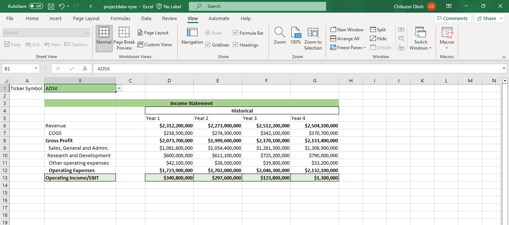
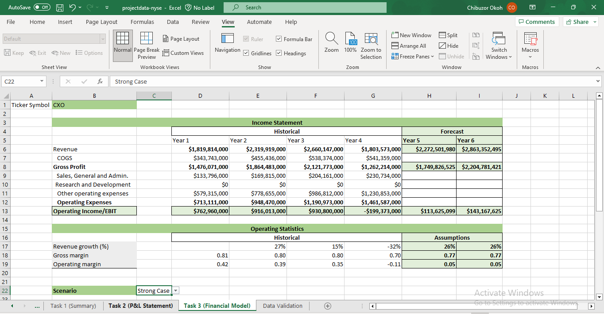
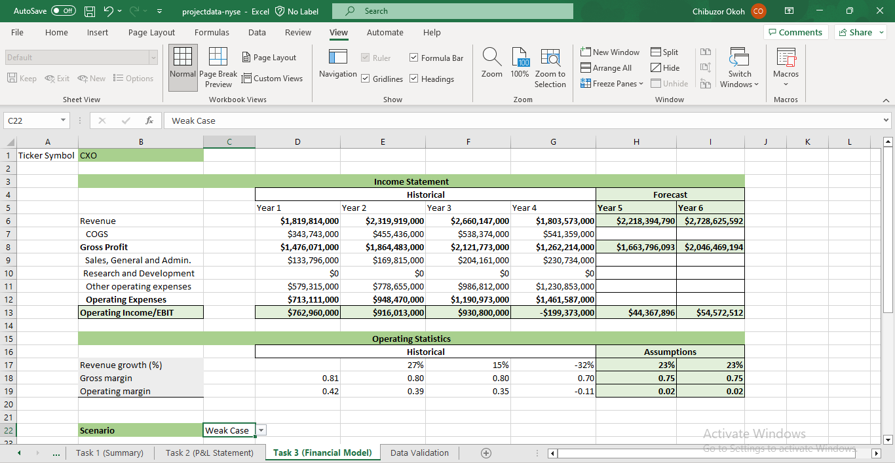
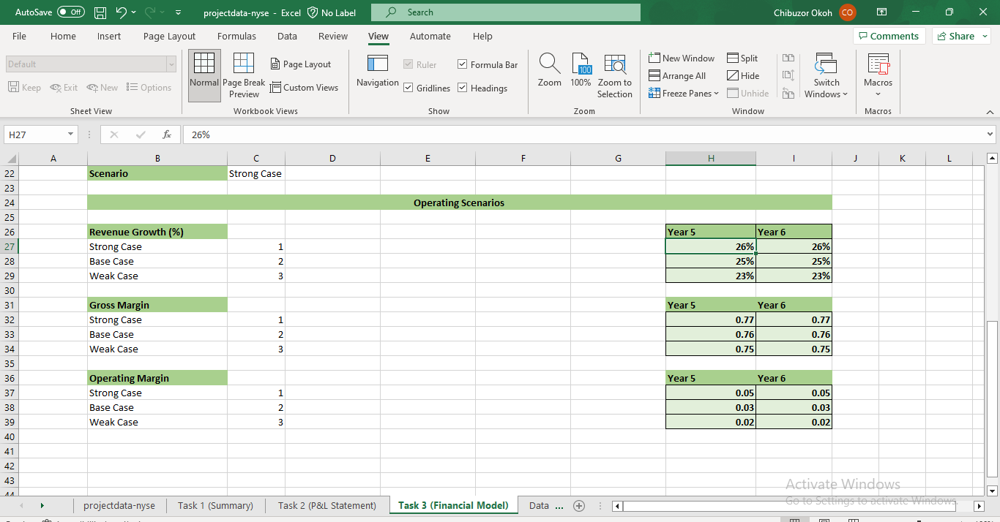

# Analyze-NYSE-Data
Udacity Project: Analyze NYSE Data

## Introduction 
The New York Stock Exchange Data Analysis project is a challenging task in the Udacity Business Analytics Nanodegree Program. This project is designed to test the student's understanding on statistics, calculating business metrics, using models to forecast future growth and the ability to communicate results effectively.
### About Dataset
---
The NYSE Data is a real life data provided by Kaggle which contains the historical financial data of various companies. The data set has 12 columns and 1,711 rows.

### Tool Used
---
Microsoft Excel (IF statements, INDEX and MATCH functions, Data Validations, Dropdowns, Mean, Median, Standard deviation and Range)

### Tasks
---
1. Identify a question about the data and answer based on your data analysis and create a presentation to share your findings.
2. Develop a dashboard for a Profit and Loss Statement 
3. Create a Financial Forecasting Model using three scenarios.

### TASK 1
---
For this task, I analyzed the revenue data for the six real estate sub industries. Over four years, these these industries generated a total revenue of $247.7 billion. The sub industry with the highest revenue was REITs, which had over $166 billion in revenue. 
For the second part of the task, I included a summary statistics showing the measures of central tendency (mean, median) and measures of spread (standard deviation and range).

### TASK 2
---
To solve this task, I created a Profit and Loss Statement dashboard that shows the key financial data, including revenue, gross profit, operating expenses and operating income before interest and taxes for the past four years.
The INDEX and MATCH functions were used to look up and retrieve the financial data from the project data worksheet.

I created a drop-down list using data validation which is connected to the profit and loss table. When a company is selected from the drop-down list, the income statement for that company is displayed in the table.

### TASK 3
---
For this task, I created a financial model that forecasts the Gross Profit, Operating Profit and Operating income for the next two years using the three scenarios (Strong case, Weak case, and Base Case).

### Strong Case:
 ---

Here are my assumptions for the strong case scenario:
- There will be a 26% increase in revenue growth over the next two years.
- There will be an increase in the gross margin and operating margin to 0.77 and 0.05 respectively.

### Base Case:
 ---

Here are my assumptions for the base case scenario:
- There will be a 25% increase in revenue growth over the next two years.
- There will be an increase in the gross margin and operating margin to 0.76 and 0.03 respectively.

### Weak Case:
---

Here are my assumptions for the weak case scenario:
- There will be a 23% increase in revenue growth over the next two years.
- There will be an increase in the gross margin and operating margin to 0.75 and 0.02 respectively.

### Connect with me
---

  [Linkedin](https://linkedin.com/in/chibuzor-data-analyst) 
  
[Twitter](https://twitter.com/cisco_official?t=zdocHllXoG5cV__V9h0pWg&s=09)
